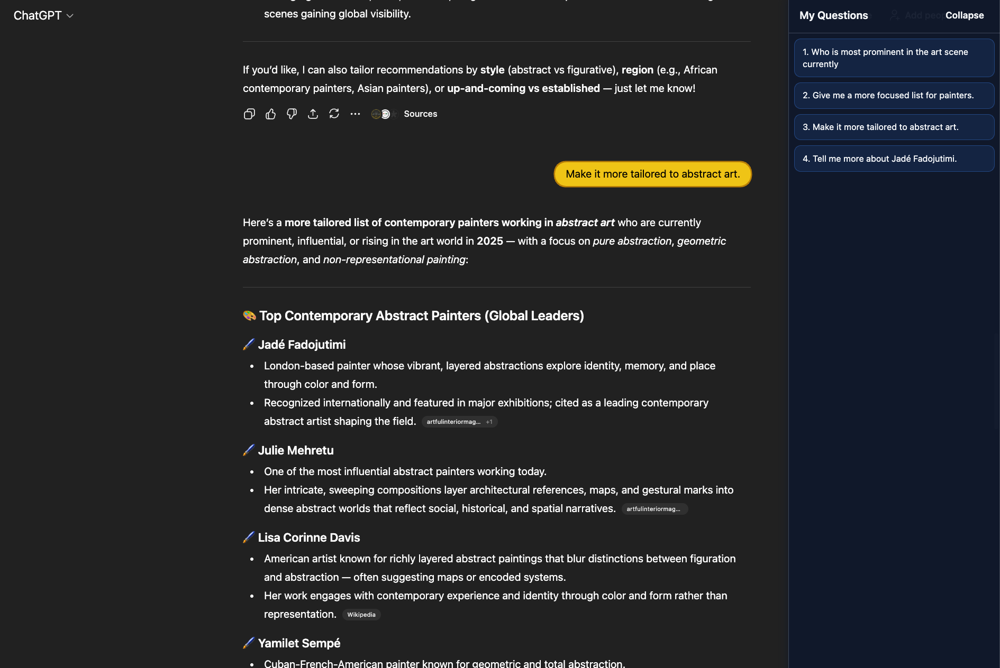

# ChatGPT Sidebar Navigator

A lightweight Chrome extension that makes long ChatGPT and Claude chats easier to skim. It highlights every user question inside the conversation and adds a collapsible in-page sidebar with jump links so you can hop back to any question.

## Features

- Manual activation via the toolbar button keeps the site untouched until you need it.
- Adds a collapsible sidebar that lists every question detected in the current ChatGPT or Claude thread.
- Highlights every user bubble with a subtle blue background so your questions stand out while you scroll.
- Clicking a question inside the sidebar smoothly scrolls the page back to that turn and briefly pulses the bubble for extra visibility.

## Project layout

```
src/      → Manifest, background worker, content script, styles
tests/    → Manual testing scenarios and notes
docs/     → High-level documentation (this file)
config/   → Reserved for future configuration (currently empty)
```

## Loading the extension

1. Open `chrome://extensions` in Chromium-based browsers.
2. Enable **Developer mode**.
3. Click **Load unpacked** and choose the `src` directory from this project.
4. Pin the “ChatGPT Sidebar Navigator” icon if you want quick access.

## Usage



1. Navigate to `https://chatgpt.com` or `https://claude.ai` and open any conversation.
2. Click the extension’s toolbar icon once. This injects the sidebar and highlights your existing questions.
3. Click any entry in the sidebar to jump back to that turn; click **Collapse** to hide the panel until you need it again.
4. Click the toolbar icon a second time to remove the sidebar and all highlights.

## Development notes

- No build step is required; every script listed in the manifest ships as-is.
- Keep files short (<300 lines) and well-commented. Additional functionality should be split into helper modules before exceeding that limit.

## Future ideas

- Persist collapsed/expanded state per session.
- Add keyboard shortcuts for quick toggling.
- Expose options for custom highlight colors and widths.
